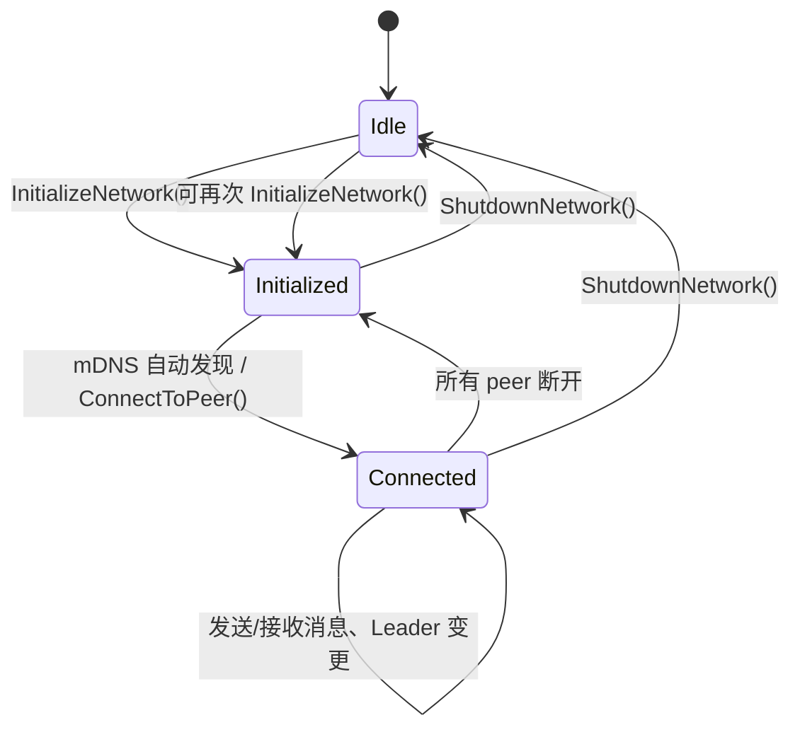

# Plan: C# 使用方式与接入指南

面向 C# IL2CPP 开发者，说明如何接入并正确使用 Rust P2P 网络库的 FFI 约定与常用调用模式。

Rust 侧接口定义见 `plan-FFIIntegration.prompt.md`。

---

## 1. 库文件部署

将编译产物放置到游戏 Mod 的插件目录：

| 平台    | 文件名                         | 放置位置示例                    |
| ------- | ------------------------------ | ------------------------------- |
| Windows | `meta_mystia_network.dll`      | `BepInEx/plugins/` 或游戏根目录 |
| macOS   | `libmeta_mystia_network.dylib` | 同上                            |

---

## 2. C# 辅助类型

### 错误码

```csharp
public static class NetErrorCode
{
    public const int OK = 0;
    public const int NotInitialized = -1;
    public const int AlreadyInitialized = -2;
    public const int InvalidArgument = -3;
    public const int ConnectionFailed = -4;
    public const int PeerNotFound = -5;
    public const int NotLeader = -6;
    public const int SendQueueFull = -7;
    public const int MessageTooLarge = -8;
    public const int SerializationError = -9;
    public const int SessionMismatch = -10;
    public const int DuplicatePeerId = -11;
    public const int VersionMismatch = -12;
    public const int MaxConnectionsReached = -13;
    public const int AlreadyConnected = -14;
    public const int InternalError = -99;
}
```

### 手动覆盖恢复策略

```csharp
/// <summary>手动指定 Leader 掉线后的恢复策略。</summary>
public enum ManualOverrideRecovery : byte
{
    /// <summary>保持 manual_override，不自动选举，等待外部再次 SetLeader。</summary>
    Hold = 0,
    /// <summary>清除 manual_override，允许自动选举接管。</summary>
    AutoElect = 1,
}
```

### Peer 状态

```csharp
public enum PeerStatus
{
    Connected = 0,
    Disconnected = 1,
    Reconnecting = 2,
    Handshaking = 3,
}
```

### 网络事件（回调线程 → 主线程的中转结构）

```csharp
public enum NetworkEventType { Message, PeerStatus, LeaderChanged, ConnectionResult }

public struct NetworkEvent
{
    public NetworkEventType Type;
    public string PeerId;
    public ushort MsgType;
    public byte[] Data;
    public PeerStatus Status;
    public bool Success;
    public int ErrorCode;
}
```

### 配置结构体

```csharp
using System.Runtime.InteropServices;

/// <summary>
/// 网络配置（与 Rust #[repr(C)] 布局一致）。
/// 用 <see cref="Default"/> 获取默认值后按需修改，传入 InitializeNetworkWithConfig。
/// </summary>
[StructLayout(LayoutKind.Sequential)]
public struct NetworkConfigFFI
{
    /// <summary>Ping/Pong 及 Raft Heartbeat 间隔（ms）。默认 500</summary>
    public ulong heartbeat_interval_ms;
    /// <summary>选举超时最小值（ms），须 > heartbeat。默认 1500</summary>
    public ulong election_timeout_min_ms;
    /// <summary>选举超时最大值（ms），须 ≥ min。默认 3000</summary>
    public ulong election_timeout_max_ms;
    /// <summary>存活超时倍数：连续 N 个周期未收到 Pong 判定离线。默认 3</summary>
    public uint  heartbeat_timeout_multiplier;
    /// <summary>断线重连初始间隔（ms），指数退避起点。默认 1000</summary>
    public ulong reconnect_initial_ms;
    /// <summary>断线重连最大间隔（ms），退避上限。默认 30000</summary>
    public ulong reconnect_max_ms;
    /// <summary>LZ4 压缩阈值（字节），payload 超此大小自动压缩。默认 512</summary>
    public uint  compression_threshold;
    /// <summary>per-peer 发送队列上限。满时返回 SendQueueFull。默认 128</summary>
    public uint  send_queue_capacity;
    /// <summary>最大连接数。默认 64</summary>
    public uint  max_connections;
    /// <summary>最大消息大小（payload 字节）。默认 262144 (256 KiB)</summary>
    public uint  max_message_size;
    /// <summary>中心化模式下 Leader 自动转发。0=需 C# 手动 Forward，1=自动。默认 1</summary>
    public byte  centralized_auto_forward;
    /// <summary>启用自动 Raft 选举。0=仅手动 SetLeader，1=自动。默认 1</summary>
    public byte  auto_election_enabled;
    /// <summary>mDNS 端口。默认 15353</summary>
    public ushort mdns_port;
    /// <summary>手动 Leader 掉线恢复策略。0=Hold，1=AutoElect。默认 0</summary>
    public byte  manual_override_recovery;
    private byte _padding1; // 对齐填充，勿修改
    private byte _padding2;
    private byte _padding3;
    /// <summary>握手超时（ms）。默认 5000</summary>
    public ulong handshake_timeout_ms;

    /// <summary>返回所有字段为默认值的配置实例。</summary>
    public static NetworkConfigFFI Default() => new()
    {
        heartbeat_interval_ms = 500,
        election_timeout_min_ms = 1500,
        election_timeout_max_ms = 3000,
        heartbeat_timeout_multiplier = 3,
        reconnect_initial_ms = 1000,
        reconnect_max_ms = 30000,
        compression_threshold = 512,
        send_queue_capacity = 128,
        max_connections = 64,
        max_message_size = 262144,
        centralized_auto_forward = 1,
        auto_election_enabled = 1,
        mdns_port = 15353,
        manual_override_recovery = 0,
        handshake_timeout_ms = 5000,
    };
}
```

### 回调委托

```csharp
/// <summary>收到用户消息时触发。在 Rust 线程调用，必须同步拷贝 peerId/data 后入队。</summary>
/// <param name="peerId">发送方 peer ID（CString 指针，回调返回后失效）</param>
/// <param name="data">消息 payload 指针（回调返回后失效）</param>
/// <param name="length">payload 字节数</param>
/// <param name="msgType">用户消息类型（≥ 0x0100）</param>
/// <param name="flags">标志位（bit 0 为压缩标志由库管理，bit 1-7 为用户自定义）</param>
[UnmanagedFunctionPointer(CallingConvention.Cdecl)]
public delegate void ReceiveCallback(IntPtr peerId, IntPtr data, int length, ushort msgType, byte flags);

/// <summary>Leader 变更时触发。leaderPeerId 为空字符串表示当前无 Leader。</summary>
[UnmanagedFunctionPointer(CallingConvention.Cdecl)]
public delegate void LeaderChangedCallback(IntPtr leaderPeerId);

/// <summary>Peer 连接状态变更时触发。status: 0=Connected, 1=Disconnected, 2=Reconnecting, 3=Handshaking。</summary>
[UnmanagedFunctionPointer(CallingConvention.Cdecl)]
public delegate void PeerStatusCallback(IntPtr peerId, int status);

/// <summary>ConnectToPeer 异步操作完成时触发。success: 0=失败, 1=成功。</summary>
[UnmanagedFunctionPointer(CallingConvention.Cdecl)]
public delegate void ConnectionResultCallback(IntPtr addr, byte success, int errorCode);
```

---

## 3. P/Invoke 导入

> **关键**：所有 `DllImport` 必须指定 `CallingConvention = CallingConvention.Cdecl`。
> Rust `extern "C"` 使用 Cdecl，而 P/Invoke 在 Windows 上默认 StdCall，不匹配会导致栈损坏。

```csharp
using System;
using System.Runtime.InteropServices;

/// <summary>
/// Rust P2P 网络库的 C# P/Invoke 绑定。
/// 所有返回 int 的方法以 <see cref="NetErrorCode"/> 表示结果（0=成功，负数=错误）。
/// 所有返回 IntPtr 的方法返回的字符串指针仅在下一次返回字符串的调用前有效，需立即用 <see cref="PtrToString"/> 拷贝。
/// </summary>
public static class MetaMystiaNetwork
{
    const string DLL = "meta_mystia_network";
    const CallingConvention CC = CallingConvention.Cdecl;
    const CharSet CS = CharSet.Ansi; // 确保 string 参数始终编组为 char*（ANSI/UTF-8），匹配 Rust *const c_char

    #region 生命周期

    /// <summary>使用默认配置初始化网络。创建 tokio Runtime，绑定 TCP 端口，启动 mDNS 发现。</summary>
    /// <param name="peerId">本节点唯一标识（如 "player_abc"），在同一 session 内不可重复</param>
    /// <param name="sessionId">房间/会话 ID，仅相同 session 的节点会互相发现和连接</param>
    /// <returns>0=成功，AlreadyInitialized=-2 表示重复初始化</returns>
    [DllImport(DLL, CallingConvention = CC, CharSet = CS)]
    public static extern int InitializeNetwork(string peerId, string sessionId);

    /// <summary>使用自定义配置初始化网络。配置会经过合法性验证（如 election_min > heartbeat）。</summary>
    /// <returns>0=成功，InvalidArgument=-3 表示配置不合法</returns>
    [DllImport(DLL, CallingConvention = CC, CharSet = CS)]
    public static extern int InitializeNetworkWithConfig(string peerId, string sessionId, ref NetworkConfigFFI config);

    /// <summary>优雅关闭：通知所有 peer 离开 → 等待发送队列清空 → 释放所有资源。关闭后可再次调用 Initialize。</summary>
    [DllImport(DLL, CallingConvention = CC)]
    public static extern int ShutdownNetwork();

    /// <summary>检查网络是否已初始化。0=否，1=是。</summary>
    [DllImport(DLL, CallingConvention = CC)]
    public static extern byte IsNetworkInitialized();

    #endregion

    #region 错误查询

    /// <summary>获取最近一次 FFI 调用的错误码。成功调用会清除错误。</summary>
    [DllImport(DLL, CallingConvention = CC)]
    public static extern int GetLastErrorCode();

    /// <summary>获取最近一次错误的人可读描述（英文）。返回 IntPtr 需立即用 PtrToString 拷贝。</summary>
    [DllImport(DLL, CallingConvention = CC)]
    public static extern IntPtr GetLastErrorMessage();

    #endregion

    #region 连接管理

    /// <summary>异步连接到指定地址。立即返回 0 表示已入队，实际结果通过 ConnectionResultCallback 回调通知。</summary>
    /// <param name="addr">目标地址，格式 "ip:port"（如 "192.168.1.100:12345"）</param>
    [DllImport(DLL, CallingConvention = CC, CharSet = CS)]
    public static extern int ConnectToPeer(string addr);

    /// <summary>主动断开与指定 peer 的连接。不会触发自动重连（与意外断线不同）。</summary>
    [DllImport(DLL, CallingConvention = CC, CharSet = CS)]
    public static extern int DisconnectPeer(string peerId);

    #endregion

    #region 本地信息

    /// <summary>获取本地 TCP 监听地址（如 "0.0.0.0:54321"），供其他 peer 手动连接。</summary>
    [DllImport(DLL, CallingConvention = CC)]
    public static extern IntPtr GetLocalAddr();

    /// <summary>获取本地 peer ID（Initialize 时传入的值）。</summary>
    [DllImport(DLL, CallingConvention = CC)]
    public static extern IntPtr GetLocalPeerId();

    /// <summary>获取当前 session ID。</summary>
    [DllImport(DLL, CallingConvention = CC)]
    public static extern IntPtr GetSessionId();

    #endregion

    #region Peer 查询

    /// <summary>返回当前 Connected 状态的 peer 数量（不含自己）。</summary>
    [DllImport(DLL, CallingConvention = CC)]
    public static extern int GetPeerCount();

    /// <summary>返回所有 peer ID 列表，以 '\n' 分隔。空字符串表示无 peer。</summary>
    [DllImport(DLL, CallingConvention = CC)]
    public static extern IntPtr GetPeerList();

    /// <summary>获取指定 peer 的网络往返延迟（毫秒）。-1 表示未知或 peer 不存在。</summary>
    [DllImport(DLL, CallingConvention = CC, CharSet = CS)]
    public static extern int GetPeerRTT(string peerId);

    /// <summary>获取指定 peer 的连接状态。0=Connected, 1=Disconnected, 2=Reconnecting, 3=Handshaking (正在握手), -1=不存在。</summary>
    [DllImport(DLL, CallingConvention = CC, CharSet = CS)]
    public static extern int GetPeerStatus(string peerId);

    #endregion

    #region Leader 管理

    /// <summary>手动指定 Leader（房主）。向所有节点广播，覆盖自动选举结果。</summary>
    [DllImport(DLL, CallingConvention = CC, CharSet = CS)]
    public static extern int SetLeader(string peerId);

    /// <summary>启用(1)或禁用(0)自动 Leader 选举。禁用后仅能通过 SetLeader 指定。</summary>
    [DllImport(DLL, CallingConvention = CC)]
    public static extern int EnableAutoLeaderElection(byte enable);

    /// <summary>获取当前 Leader 的 peer ID。空字符串表示当前无 Leader。</summary>
    [DllImport(DLL, CallingConvention = CC)]
    public static extern IntPtr GetCurrentLeader();

    /// <summary>检查本节点是否是当前 Leader。0=否，1=是。</summary>
    [DllImport(DLL, CallingConvention = CC)]
    public static extern byte IsLeader();

    #endregion

    #region 中心化模式

    /// <summary>启用(1)或禁用(0)中心化模式。启用后非 Leader 的广播消息会经 Leader 中转。</summary>
    [DllImport(DLL, CallingConvention = CC)]
    public static extern int SetCentralizedMode(byte enable);

    /// <summary>查询中心化模式是否启用。0=P2P 直连，1=经 Leader 中转。</summary>
    [DllImport(DLL, CallingConvention = CC)]
    public static extern byte IsCentralizedMode();

    /// <summary>中心化模式下，Leader 收到转发请求时是否自动广播(1)还是仅回调由 C# 决定(0)。</summary>
    [DllImport(DLL, CallingConvention = CC)]
    public static extern int SetCentralizedAutoForward(byte enable);

    /// <summary>查询自动转发状态。</summary>
    [DllImport(DLL, CallingConvention = CC)]
    public static extern byte IsCentralizedAutoForward();

    #endregion

    #region 压缩

    /// <summary>设置 LZ4 压缩阈值（字节）。payload 超过此大小时自动压缩。默认 512。</summary>
    [DllImport(DLL, CallingConvention = CC)]
    public static extern int SetCompressionThreshold(uint threshold);

    #endregion

    #region 消息发送

    /// <summary>广播消息给所有已连接 peer。中心化模式下非 Leader 的调用会自动经 Leader 中转。</summary>
    /// <param name="data">消息 payload</param>
    /// <param name="length">payload 字节数</param>
    /// <param name="msgType">用户消息类型，必须 ≥ 0x0100</param>
    /// <param name="flags">用户自定义标志（bit 1-7），bit 0 由库管理</param>
    [DllImport(DLL, CallingConvention = CC)]
    public static extern int BroadcastMessage(byte[] data, int length, ushort msgType, byte flags);

    /// <summary>发送消息给指定 peer。</summary>
    [DllImport(DLL, CallingConvention = CC, CharSet = CS)]
    public static extern int SendToPeer(string targetPeerId, byte[] data, int length, ushort msgType, byte flags);

    /// <summary>发送消息给当前 Leader。若自己就是 Leader 则本地处理。</summary>
    [DllImport(DLL, CallingConvention = CC)]
    public static extern int SendToLeader(byte[] data, int length, ushort msgType, byte flags);

    /// <summary>以 Leader 身份广播消息给所有 peer。非 Leader 调用返回 NotLeader(-6)。</summary>
    [DllImport(DLL, CallingConvention = CC)]
    public static extern int SendFromLeader(byte[] data, int length, ushort msgType, byte flags);

    /// <summary>
    /// Leader 专用：将消息转发给指定 peer 或广播（排除原始发送者）。
    /// 非 Leader 调用返回 NotLeader(-6)。
    /// </summary>
    /// <param name="fromPeerId">原始发送者 ID（广播时排除此 peer）</param>
    /// <param name="targetPeerId">目标 peer ID；传 <c>null</c>（即 C# <c>null</c> 字符串）表示广播给除 from 外的所有 peer。<b>注意：空字符串不等同于 null</b>，会被当作 peer ID 查找，将返回 PeerNotFound(-5)</param>
    [DllImport(DLL, CallingConvention = CC, CharSet = CS)]
    public static extern int ForwardMessage(string fromPeerId, string targetPeerId, byte[] data, int length, ushort msgType, byte flags);

    #endregion

    #region 回调注册

    /// <summary>注册消息接收回调。传 null 注销。委托引用必须保存为静态字段防止 GC 回收。</summary>
    [DllImport(DLL, CallingConvention = CC)]
    public static extern int RegisterReceiveCallback(ReceiveCallback callback);

    /// <summary>注册 Leader 变更回调。传 null 注销。</summary>
    [DllImport(DLL, CallingConvention = CC)]
    public static extern int RegisterLeaderChangedCallback(LeaderChangedCallback callback);

    /// <summary>注册 Peer 连接状态变更回调。传 null 注销。</summary>
    [DllImport(DLL, CallingConvention = CC)]
    public static extern int RegisterPeerStatusCallback(PeerStatusCallback callback);

    /// <summary>注册 ConnectToPeer 异步结果回调。传 null 注销。</summary>
    [DllImport(DLL, CallingConvention = CC)]
    public static extern int RegisterConnectionResultCallback(ConnectionResultCallback callback);

    #endregion

    #region 日志

    /// <summary>启用 Rust 侧日志输出（需编译时开启 logging feature）。仅首次调用生效，后续为空操作。</summary>
    [DllImport(DLL, CallingConvention = CC)]
    public static extern int EnableLogging(byte enable);

    #endregion

    #region 辅助方法

    /// <summary>将 native 字符串指针转为 C# string。null 指针返回空字符串。必须在下一次返回字符串的 FFI 调用前使用。</summary>
    public static string PtrToString(IntPtr ptr) =>
        ptr == IntPtr.Zero ? "" : Marshal.PtrToStringAnsi(ptr);

    /// <summary>检查返回码，非 OK 时抛出异常（含错误消息）。</summary>
    public static void Check(int code)
    {
        if (code != NetErrorCode.OK)
            throw new Exception($"Network error {code}: {PtrToString(GetLastErrorMessage())}");
    }

    #endregion
}
```

---

## 4. 使用约束（必读）

| 约束                        | 说明                                                                                                                                                  |
| --------------------------- | ----------------------------------------------------------------------------------------------------------------------------------------------------- |
| **CallingConvention.Cdecl** | 每个 `DllImport` 必须指定。Rust `extern "C"` = Cdecl，P/Invoke 默认 StdCall（Windows），不匹配导致栈损坏崩溃。                                        |
| **字符串指针即用即拷**      | `GetLocalAddr()` 等返回的 `IntPtr` 仅在下一次返回字符串的 FFI 调用前有效。立即用 `PtrToString()` 拷贝。                                               |
| **回调内禁止调 FFI**        | 回调在 Rust 线程触发（非 Unity 主线程）。回调内不得调用任何 FFI 函数（如 `SendToPeer`），否则死锁。将事件入队 `ConcurrentQueue`，由 `Update()` 消费。 |
| **回调内同步拷贝数据**      | 回调参数的指针（`peerId`、`data`）在回调返回后被 Rust 释放。必须在回调体内完成 `Marshal.PtrToStringAnsi()` 和 `Marshal.Copy()`。                      |
| **PeerStatus 值范围** | `PeerStatusCallback` 返回的状态是 0=Connected、1=Disconnected、2=Reconnecting、3=Handshaking（握手中）。请在 C# 枚举中保持一致。 |
| **保持委托引用** | 传给 `Register*Callback` 的委托必须保存为 **静态字段**，防止 GC 回收导致野指针崩溃。 |
| **`[AOT.MonoPInvokeCallback]`** | IL2CPP 要求所有从 native 调用的回调方法标记此特性，否则 AOT 编译不生成跳板代码。 |
| **布尔用 byte** | 所有布尔语义参数/返回值为 `byte`（0/1），不要用 C# `bool`。 |
| **msg_type ≥ 0x0100** | 用户消息类型必须 ≥ 256。0x0001-0x00FF 为内部协议保留。 |
| **flags bit 0 保留** | `flags` 的 bit 0 由库管理（LZ4 压缩），用户使用 bit 1-7。 |
| **不并发调字符串 FFI** | 返回 `IntPtr` 的函数不要在多线程同时调用。 |

## 快速映射（常用 FFI 调用与行为提醒）

- `InitializeNetwork` / `InitializeNetworkWithConfig`：创建 runtime 并启动所有子系统；调用成功后才可调用其余接口。
- `ConnectToPeer(addr)`：异步入队，实际成功/失败通过 `RegisterConnectionResultCallback` 的回调通知。
- `BroadcastMessage` / `SendToPeer`：函数会验证 `msgType >= 0x0100`、长度上限并清除 `flags` 的 bit0；若队列满返回 `SendQueueFull`。
- `SendFromLeader` / `ForwardMessage`：仅在本节点为 Leader 时生效，非 Leader 调用返回 `NotLeader`。
- 字符串返回：`GetLocalAddr`、`GetPeerList` 等返回的 `IntPtr` 在下一次返回字符串前有效，务必立即 `Marshal.PtrToStringAnsi()` 并保存结果。

（在 C# 示例与绑定实现中应把这些行为当作契约进行实现和测试。）

---

## 5. 完整接入示例

下面是一个可直接嵌入 BepInEx 插件的完整示例类。

```csharp
using System;
using System.Collections.Concurrent;
using System.Runtime.InteropServices;
using System.Text;
using UnityEngine;

/// <summary>
/// 网络管理器：封装 Rust P2P 库的 FFI 调用。
/// 挂载到一个不被销毁的 GameObject 上（DontDestroyOnLoad）。
/// </summary>
public class NetworkManager : MonoBehaviour
{
    // ===== 用户自定义消息类型（必须 ≥ 0x0100）=====
    public const ushort MSG_PLAYER_MOVE = 0x0100;
    public const ushort MSG_CHAT        = 0x0101;

    // ===== 回调委托（静态字段防 GC 回收）=====
    static ReceiveCallback          _onReceive;
    static PeerStatusCallback       _onPeerStatus;
    static LeaderChangedCallback    _onLeaderChanged;
    static ConnectionResultCallback _onConnectionResult;

    // ===== 事件队列（回调线程写入 → 主线程读取）=====
    static readonly ConcurrentQueue<NetworkEvent> EventQueue = new();

    // ===== 生命周期 =====

    void Awake()
    {
        DontDestroyOnLoad(gameObject);

        // 1. 注册回调（必须在 Initialize 前注册，保存为静态字段）
        _onReceive          = OnReceive;
        _onPeerStatus       = OnPeerStatus;
        _onLeaderChanged    = OnLeaderChanged;
        _onConnectionResult = OnConnectionResult;

        MetaMystiaNetwork.RegisterReceiveCallback(_onReceive);
        MetaMystiaNetwork.RegisterPeerStatusCallback(_onPeerStatus);
        MetaMystiaNetwork.RegisterLeaderChangedCallback(_onLeaderChanged);
        MetaMystiaNetwork.RegisterConnectionResultCallback(_onConnectionResult);

        // 2. 初始化（同 session_id 的节点自动通过 mDNS 发现并连接）
        string peerId = "player_" + UnityEngine.Random.Range(1000, 9999);
        MetaMystiaNetwork.Check(MetaMystiaNetwork.InitializeNetwork(peerId, "my_room"));

        Debug.Log($"Network initialized. Local: {MetaMystiaNetwork.PtrToString(MetaMystiaNetwork.GetLocalAddr())}");
    }

    void OnDestroy()
    {
        MetaMystiaNetwork.ShutdownNetwork();
    }

    // ===== 主线程事件处理 =====

    void Update()
    {
        while (EventQueue.TryDequeue(out var ev))
        {
            switch (ev.Type)
            {
                case NetworkEventType.Message:
                    HandleMessage(ev.PeerId, ev.MsgType, ev.Data);
                    break;
                case NetworkEventType.PeerStatus:
                    Debug.Log($"Peer {ev.PeerId} → {ev.Status}");
                    break;
                case NetworkEventType.LeaderChanged:
                    Debug.Log($"Leader changed → {ev.PeerId}");
                    break;
                case NetworkEventType.ConnectionResult:
                    Debug.Log($"Connect {ev.PeerId}: {(ev.Success ? "OK" : $"Failed({ev.ErrorCode})")}");
                    break;
            }
        }
    }

    void HandleMessage(string peerId, ushort msgType, byte[] data)
    {
        switch (msgType)
        {
            case MSG_PLAYER_MOVE:
                // 反序列化位置...
                break;
            case MSG_CHAT:
                string text = Encoding.UTF8.GetString(data);
                Debug.Log($"[Chat] {peerId}: {text}");
                break;
        }
    }

    // ===== 发送 =====

    public void BroadcastChat(string text)
    {
        byte[] data = Encoding.UTF8.GetBytes(text);
        MetaMystiaNetwork.BroadcastMessage(data, data.Length, MSG_CHAT, 0);
    }

    // ===== 回调实现（Rust 线程调用，仅拷贝数据入队）=====

    [AOT.MonoPInvokeCallback(typeof(ReceiveCallback))]
    static void OnReceive(IntPtr peerId, IntPtr data, int length, ushort msgType, byte flags)
    {
        byte[] payload = new byte[length];
        Marshal.Copy(data, payload, 0, length);
        EventQueue.Enqueue(new NetworkEvent
        {
            Type = NetworkEventType.Message,
            PeerId = Marshal.PtrToStringAnsi(peerId),
            MsgType = msgType,
            Data = payload,
        });
    }

    [AOT.MonoPInvokeCallback(typeof(PeerStatusCallback))]
    static void OnPeerStatus(IntPtr peerId, int status)
    {
        EventQueue.Enqueue(new NetworkEvent
        {
            Type = NetworkEventType.PeerStatus,
            PeerId = Marshal.PtrToStringAnsi(peerId),
            Status = (PeerStatus)status,
        });
    }

    [AOT.MonoPInvokeCallback(typeof(LeaderChangedCallback))]
    static void OnLeaderChanged(IntPtr leaderPeerId)
    {
        EventQueue.Enqueue(new NetworkEvent
        {
            Type = NetworkEventType.LeaderChanged,
            PeerId = Marshal.PtrToStringAnsi(leaderPeerId),
        });
    }

    [AOT.MonoPInvokeCallback(typeof(ConnectionResultCallback))]
    static void OnConnectionResult(IntPtr addr, byte success, int errorCode)
    {
        EventQueue.Enqueue(new NetworkEvent
        {
            Type = NetworkEventType.ConnectionResult,
            PeerId = Marshal.PtrToStringAnsi(addr),
            Success = success != 0,
            ErrorCode = errorCode,
        });
    }
}
```

---

## 6. 常见操作速查

```csharp
// ----- 查询 -----
int count = MetaMystiaNetwork.GetPeerCount();
string[] peers = MetaMystiaNetwork.PtrToString(MetaMystiaNetwork.GetPeerList())
    .Split('\n', StringSplitOptions.RemoveEmptyEntries);
string leader = MetaMystiaNetwork.PtrToString(MetaMystiaNetwork.GetCurrentLeader());
bool iAmLeader = MetaMystiaNetwork.IsLeader() != 0;
int rtt = MetaMystiaNetwork.GetPeerRTT("some_peer"); // -1 = 未知

// ----- Leader 管理 -----
MetaMystiaNetwork.SetLeader("player_abc");     // 手动指定
MetaMystiaNetwork.EnableAutoLeaderElection(0); // 禁用自动选举

// ----- 中心化模式 -----
MetaMystiaNetwork.SetCentralizedMode(1);        // 所有广播经 Leader 中转
MetaMystiaNetwork.SetCentralizedAutoForward(0); // Leader 不自动转发，由 C# 决定
MetaMystiaNetwork.ForwardMessage("from_id", null, data, data.Length, msgType, 0);
//                                          ↑ null = 广播给除 from 外的所有 peer

// ----- 手动连接/断开 -----
MetaMystiaNetwork.ConnectToPeer("192.168.1.100:12345");
MetaMystiaNetwork.DisconnectPeer("some_peer");

// ----- 自定义配置初始化 -----
var config = NetworkConfigFFI.Default();
config.heartbeat_interval_ms = 300;
MetaMystiaNetwork.Check(MetaMystiaNetwork.InitializeNetworkWithConfig("my_id", "my_room", ref config));

// ----- 重新加入 -----
MetaMystiaNetwork.ShutdownNetwork();
MetaMystiaNetwork.InitializeNetwork("my_id", "another_room");
```

---

## 7. 生命周期流程图



---

## 8. 错误处理

```csharp
int result = MetaMystiaNetwork.SendToPeer("xyz", data, data.Length, 0x0100, 0);
if (result != NetErrorCode.OK)
{
    switch (result)
    {
        case NetErrorCode.PeerNotFound:
            Debug.LogWarning("Peer 已离开"); break;
        case NetErrorCode.SendQueueFull:
            Debug.LogWarning("发送队列满，丢弃本条"); break;
        case NetErrorCode.NotInitialized:
            Debug.LogError("网络未初始化"); break;
        default:
            Debug.LogError($"错误 {result}: {MetaMystiaNetwork.PtrToString(MetaMystiaNetwork.GetLastErrorMessage())}");
            break;
    }
}
```
