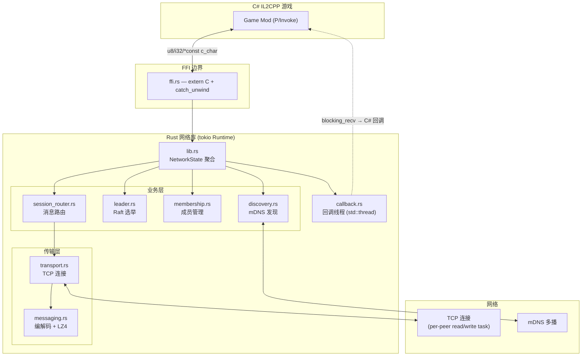
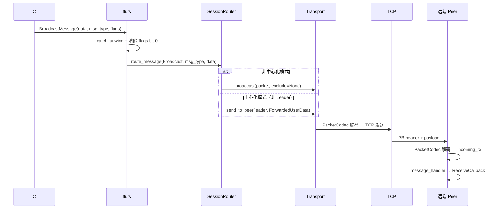
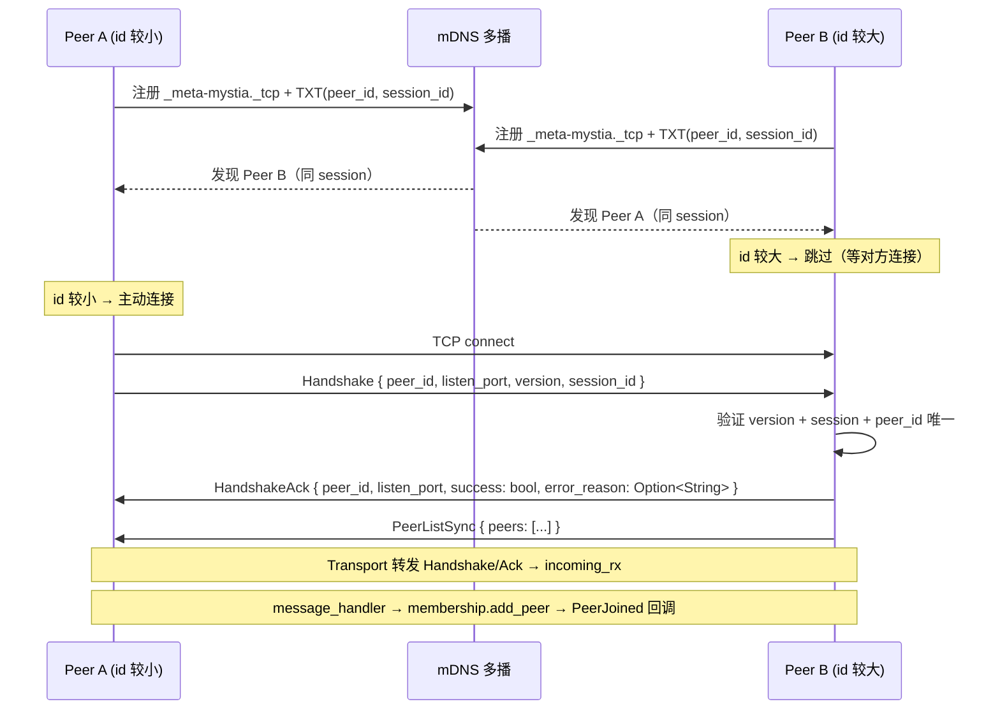
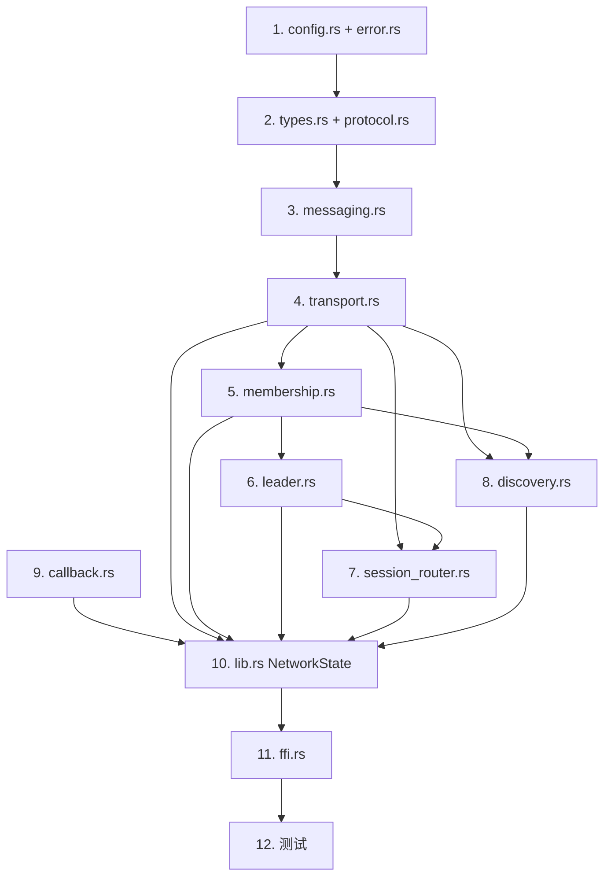

# Plan: P2P 网络组件动态库 — 总纲

为 MetaMystia Mod 提供 P2P 网络库，构建为 cdylib（Windows `.dll` / macOS `.dylib`），通过 `extern "C"` FFI 暴露给 C# IL2CPP。

注意：文中同时出现内部 Rust 方法（snake_case）与 FFI 导出（CamelCase）；文档会明确区分并示例对应关系。

**核心能力：**

- TCP 全双工传输 + LZ4 透明压缩
- mDNS 局域网自动发现 + 手动 IP 连接
- 简化 Raft 自动选主 + 手动指定
- 可选中心化模式（消息经 Leader 中转）
- session_id 房间隔离（同 LAN 多房间互不干扰）

> **本文件为总纲大纲**，各模块详细设计见子计划文档。

---

## 子计划索引

| 子计划文档                         | 覆盖内容                                                                                                                              |
| ---------------------------------- | ------------------------------------------------------------------------------------------------------------------------------------- |
| `plan-CoreTypesProtocol.prompt.md` | Cargo.toml 依赖、config.rs、types.rs、protocol.rs、error.rs                                                                           |
| `plan-Transport.prompt.md`         | transport.rs（TCP 连接管理、粘包、重连）、messaging.rs（编解码）                                                                      |
| `plan-MembershipLeader.prompt.md`  | membership.rs（成员管理、心跳）、leader.rs（简化 Raft 选主）                                                                          |
| `plan-RoutingDiscovery.prompt.md`  | session_router.rs（消息路由）、discovery.rs（mDNS 发现）                                                                              |
| `plan-FFIIntegration.prompt.md`    | callback.rs、ffi.rs、lib.rs、日志系统<br>包含所有导出接口：初始化/注销、连接/断开、状态查询、消息发送、领导人控制、回调注册及日志切换 |
| `plan-Tests.prompt.md`             | 全模块测试清单、测试辅助工具                                                                                                          |
| `plan-CSharpUsage.prompt.md`       | C# P/Invoke 声明、使用约束、典型流程、错误处理                                                                                        |

---

## 模块结构总览

| 文件                    | 职责                                                                                 |
| ----------------------- | ------------------------------------------------------------------------------------ |
| `src/lib.rs`            | 模块声明 + 全局状态（`NetworkState`）+ tokio Runtime 生命周期管理                    |
| `src/config.rs`         | 配置结构体 `NetworkConfig` + 常量定义                                                |
| `src/types.rs`          | 公共类型：`PeerId`, `PeerInfo`, `PeerStatus`, `MessageTarget`, `ForwardTarget` 等    |
| `src/protocol.rs`       | 协议常量（版本号、msg_type 定义、最大消息大小）+ InternalMessage 枚举                |
| `src/transport.rs`      | TCP 连接管理、粘包处理（`PacketCodec`）、自动重连、TCP Keep-alive、发送/接收通道管理 |
| `src/messaging.rs`      | 消息编解码、LZ4 压缩、序列化/反序列化                                                |
| `src/membership.rs`     | Peer 列表管理、心跳检测、RTT 测量、在线状态、Peer ID 冲突检测                        |
| `src/leader.rs`         | 简化 Raft Leader Election + 手动覆盖 + 2 节点特殊处理                                |
| `src/session_router.rs` | 消息路由（Broadcast/ToPeer/ToLeader）+ 中心化模式 + 自动转发 + 发送队列管理          |
| `src/discovery.rs`      | mDNS 服务注册/发现（含 session_id 房间隔离）+ 手动连接入口                           |
| `src/callback.rs`       | 回调管理器：队列 + 专用线程调度 C# 回调                                              |
| `src/ffi.rs`            | 所有 `extern "C"` 接口 + panic 捕获 + 字符串转换辅助 + 错误码                        |
| `src/error.rs`          | 统一错误类型 `NetworkError` + 错误码常量 + 映射                                      |

---

## 架构图

### 分层架构



### 消息发送流程（C# → 远端 peer）



### 连接建立流程（mDNS 自动发现）



---

## 实现顺序（依赖关系驱动）



**阶段划分：**

1. **基础层**（对应 `plan-CoreTypesProtocol`）：config.rs + error.rs → types.rs + protocol.rs
2. **传输层**（对应 `plan-Transport`）：messaging.rs → transport.rs
3. **业务层**（对应 `plan-MembershipLeader` + `plan-RoutingDiscovery`）：membership.rs → leader.rs → session_router.rs → discovery.rs
4. **接口层**（对应 `plan-FFIIntegration`）：callback.rs → lib.rs → ffi.rs → 测试

---

## 代码风格

| 原则       | 实践                                                                                                                                                                        |
| ---------- | --------------------------------------------------------------------------------------------------------------------------------------------------------------------------- |
| **函数式** | 编解码（`encode_packet`、`decode_payload`）为纯函数，无副作用；配置验证返回 `Result`；消息处理为 `match msg_type` 分发而非 OOP 继承                                         |
| **可测试** | 子系统（`MembershipManager`、`LeaderElection`）为纯状态管理器，不持有网络 IO 引用，可独立单元测试；`TransportManager::new()` 返回 `(Arc<Self>, incoming_rx)` 分离 IO 与逻辑 |
| **模块化** | 12 个独立模块，单一职责；通过 `Arc<T>` 组合（非继承）；每个模块可独立 `cargo test`                                                                                          |
| **可复用** | `PacketCodec` 可用于任何长度前缀 TCP 分帧；`messaging.rs` 编解码层与传输层解耦；`error.rs` 错误体系可跨模块共享                                                             |

**编码约束：**

- 所有 `pub` 函数优先返回 `Result<T, NetworkError>` 而非 panic
- 状态变更通过 channel 通知而非直接回调，保持模块间解耦
- 内部类型不跨 FFI 边界暴露：FFI 仅使用 C 原语（`i32`, `u8`, `u16`, `u32`, `*const c_char`, `*const u8`）
- Rust 分配的内存永远由 Rust 释放，C# 只读不写

---

## 跨平台支持

| 平台    | 产物名称                       | 验证工具           |
| ------- | ------------------------------ | ------------------ |
| Windows | `meta_mystia_network.dll`      | `dumpbin /exports` |
| macOS   | `libmeta_mystia_network.dylib` | `nm -gU` / `otool` |

**平台差异注意事项：**

- **TCP Keep-alive retries**：`TCP_KEEPCNT`（重试次数）在 Windows 上不可直接设置，仅 macOS/Linux 支持。代码应在 Windows 上跳过此设置而非报错。
- **mDNS**：macOS 原生支持 Bonjour，Windows 依赖 `mdns-sd` crate 的多播 UDP 实现，两者行为一致但需分别测试。
- **DLL 路径**：C# P/Invoke 的 `DllImport` 中库名不带扩展名（如 `"meta_mystia_network"`），运行时自动匹配平台扩展名。

---

## 关键设计决策

### 序列化与协议

| 决策             | 内容                                   | 理由                          |
| ---------------- | -------------------------------------- | ----------------------------- |
| postcard + serde | 替代 bincode（v3 已废弃）              | 轻量、`no_std` 友好           |
| 协议版本握手     | `PROTOCOL_VERSION` 在 Handshake 中交换 | 未来升级兼容性                |
| 消息上限 1MB     | `MAX_MESSAGE_SIZE` 硬限制              | 防内存耗尽                    |
| msg_type 分区    | 0x0001-00FF 内部、0x0100-FFFF 用户     | 发送函数验证 ≥ 0x0100，防误用 |
| flags bit 0      | 压缩标志由库管理，用户使用 bit 1-7     | 透明压缩，用户扩展空间        |

### 选举与成员

| 决策              | 内容                                        | 理由                                                                                 |
| ----------------- | ------------------------------------------- | ------------------------------------------------------------------------------------ |
| 简化 Raft         | 自实现 ~400 行 Leader Election              | openraft 引入 ~18K 行依赖                                                            |
| 时间配置          | 心跳 500ms，选举 1500-3000ms                | 心跳 << 选举超时                                                                     |
| ≤2 节点           | 阈值=1，自投即当选                          | 2 人房间一方掉线仍可选主                                                             |
| 心跳分离          | Raft Heartbeat（Leader）+ Ping/Pong（全员） | 领导权与存活检测职责分离                                                             |
| broadcast channel | 成员事件用 `tokio::sync::broadcast`         | 多订阅者；Lagged 时记录 warn 并退出 drain 循环（成员状态通过 RwLock 直接访问仍完整） |

### 网络与连接

| 决策           | 内容                                         | 理由                                              |
| -------------- | -------------------------------------------- | ------------------------------------------------- |
| 端口随机分配   | 绑定 `0.0.0.0:0`                             | 避免冲突                                          |
| 握手超时 5s    | 未完成握手则断开                             | 防半连接占资源                                    |
| mDNS 去重      | peer_id 字典序小者主动连接                   | 防双向同时连接                                    |
| PeerListSync   | 握手后同步已知 peer 列表                     | 握手完成时由被连接方发送，补充 mDNS、加速拓扑收敛 |
| 主动断开不重连 | `DisconnectPeer` 设 `should_reconnect=false` | 区分主动/意外断线                                 |
| 房间隔离       | session_id + mDNS TXT                        | 同 LAN 多房间互不干扰                             |
| 连接数 64 上限 | `MAX_CONNECTIONS`                            | 防资源耗尽                                        |

### FFI 安全

| 决策                    | 内容                                            | 理由                                     |
| ----------------------- | ----------------------------------------------- | ---------------------------------------- |
| `u8` 代替 `bool`        | FFI 函数/回调/`#[repr(C)]` 结构体全用 `u8`      | Rust 1B ≠ C# 4B，IL2CPP MarshalAs 不稳定 |
| `catch_unwind`          | 每个 extern "C" 函数包裹                        | panic 跨 FFI 是 UB                       |
| 字符串单值替换          | `LAST_RETURNED_STRING` 下次调用时释放上次       | C# `PtrToStringAnsi` 同步拷贝天然安全    |
| 回调禁重入              | C# 回调内不得调 FFI                             | 防死锁/逻辑混乱                          |
| 错误码 + GetLastError   | FFI 统一返回 `i32`                              | C# 可检查                                |
| `NetworkConfigFFI` 映射 | 提供与 Rust `NetworkConfig` 完全对应的 C 结构体 | 保证二进制兼容且可由 C# 端构建           |
| Config 验证             | `InitializeNetworkWithConfig` 调 `validate()`   | 防无效参数                               |

### 架构

| 决策                     | 内容                                              | 理由                          |
| ------------------------ | ------------------------------------------------- | ----------------------------- |
| cdylib only              | 不加 `rlib`                                       | 纯 C 动态库，减体积           |
| `Mutex<Option<Runtime>>` | 非 `OnceLock`                                     | 支持 Shutdown 后再 Initialize |
| Transport 解耦           | `new()` 返回 `(Arc<Self>, incoming_rx)`           | IO 与逻辑分离，可测试         |
| 子系统纯状态             | MembershipManager/LeaderElection 不持有 Transport | 中心化消息循环避免循环依赖    |
| 回调专用线程             | `std::thread` + `blocking_recv`                   | 不阻塞 tokio runtime          |
| parking_lot              | 替代 std Mutex                                    | 更高效，支持 `UnwindSafe`     |
| shutdown 先发后关        | PeerLeave → drain → cancel → cleanup              | cancel 后 write task 已退出   |

---

## Verification

1. **编译验证（双平台）**

   ```powershell
   # Windows
   cargo build --release
   cargo build --release --features logging
   ```

   ```bash
   # macOS
   cargo build --release --target aarch64-apple-darwin
   ```

2. **测试验证**

   ```powershell
   cargo test                           # 运行所有测试
   cargo test --release                 # Release 模式测试
   cargo test test_leader --nocapture   # 运行特定测试并显示输出
   ```

3. **产物检查**

   ```powershell
   # Windows: 检查体积（预期 < 2MB）+ 导出符号
   (Get-Item target/release/meta_mystia_network.dll).Length / 1MB
   dumpbin /exports target/release/meta_mystia_network.dll
   ```

   ```bash
   # macOS: 检查体积 + 导出符号
   ls -lh target/release/libmeta_mystia_network.dylib
   nm -gU target/release/libmeta_mystia_network.dylib | grep -E "^_[A-Z]"
   ```

4. **C# P/Invoke 测试**

   ```csharp
   // 库名不带扩展名，运行时自动匹配 .dll / .dylib
   [DllImport("meta_mystia_network")]
   static extern int InitializeNetwork(string peerId, string sessionId);

   [DllImport("meta_mystia_network")]
   static extern int ConnectToPeer(string addr);

   [DllImport("meta_mystia_network")]
   static extern int DisconnectPeer(string peerId);

   [DllImport("meta_mystia_network")]
   static extern IntPtr GetLocalAddr();

   [DllImport("meta_mystia_network")]
   static extern int GetPeerCount();

   [DllImport("meta_mystia_network")]
   static extern IntPtr GetPeerList();

   [DllImport("meta_mystia_network")]
   static extern int ShutdownNetwork();

   // init
   var result = InitializeNetwork("test_peer", "test_session");
   Assert.AreEqual(0, result);

   // connect to another peer by IP:port
   result = ConnectToPeer("127.0.0.1:12345");
   // connection result will be delivered via callback; or
   // check peer count later

   var peerCount = GetPeerCount();
   var listPtr = GetPeerList();
   var peerList = Marshal.PtrToStringAnsi(listPtr);
   Console.WriteLine($"Peers: {peerList}");

   var addr = Marshal.PtrToStringAnsi(GetLocalAddr());
   Console.WriteLine($"Local address: {addr}");

   result = DisconnectPeer("other_peer_id");
   ```

   - 验证 mDNS 发现 → 自动连接 → 选主 → 消息收发
   - 杀掉 Leader 进程 → 验证重新选举
   - 恢复 Leader 进程 → 验证重连
   - **双平台分别验证**
